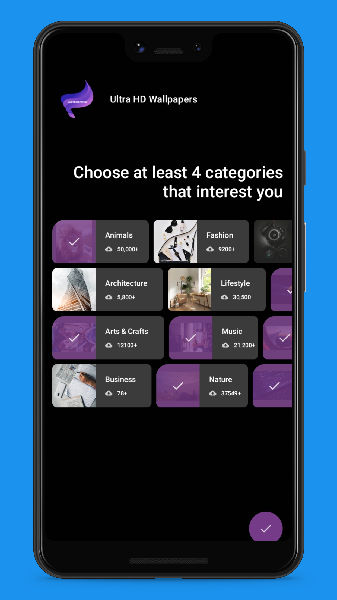
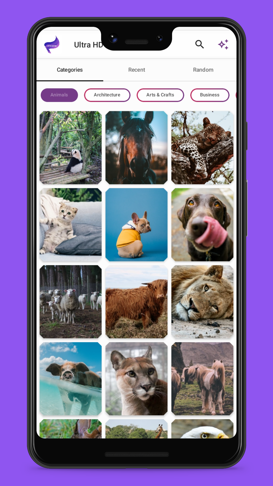
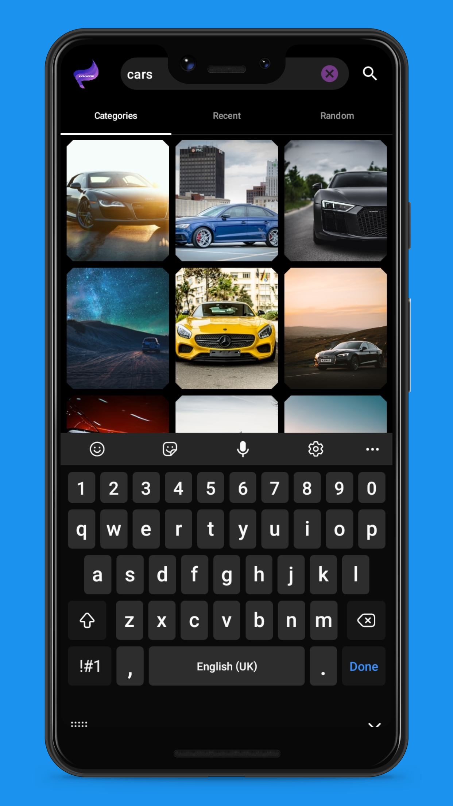
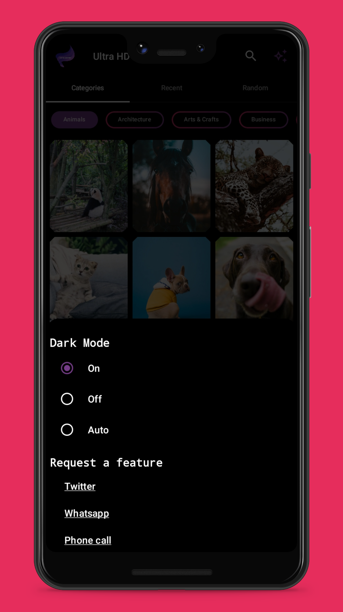

<h1 align="center">
  <br>
  
  <br>
  UHD Wallpapers
  <br>
</h1>

This an android application  show cases different sets of images from unsplash and allows its users to download and set them as wallpapers.
## Features
#### Splash


#### [Onboarding Screen](app/src/main/java/com/anorlddroid/wallpapers4e/ui/onboarding/)
The onboarding screen allows users to customize their experience by selecting  categories of images.



#### [Home Screen](app/src/main/java/com/anorlddroid/wallpapers4e/ui/home/)
* The home screen has three tabs, namely: [Categories](app/src/main/java/com/anorlddroid/wallpapers4e/ui/home/Categories.kt) that displays the categories the user chose on onboarding screen, [Recent](app/src/main/java/com/anorlddroid/wallpapers4e/ui/home/Recent.kt) displays recent images and [Random](app/src/main/java/com/anorlddroid/wallpapers4e/ui/home/Random.kt) displays random images.

.

* The top bar includes a search bar for better user experience, by default it is hidden but can be accessed using the search icon.

.


* Toggle between darkmode and light mode or use system default options are included in the bottom sheet accessed across any of the three tabs, the user can also request for features or report a bug.


#### [Photo Details Screen](app/src/main/java/com/anorlddroid/wallpapers4e/ui/details/)
Displays details of a selected image, featuring:

* A share icon image at the top right corner of the top bar for sharing the image with your loved ones.
* A DownloadButton that can be clicked  to download the image.
* A setWallpaper button that displays a menu to choose where you want the wallpaper set.
* A more button that displays the description and creation date of the image


## Data
Imagery is sourced from [Unsplash](https://unsplash.com/)  and loaded using [glideimage][coil-accompanist] from [landscapist](https://github.com/skydoves/landscapist).


## How To Use 

To clone and run this application, you'll  need to use [Android Studio Arctic Fox](https://developer.android.com/studio) or latest.

From your command line:

```bash
# Clone this repository
$ git clone https://github.com/anorld-droid/UHD-Wallpapers.git

# Go into the repository
$ cd UHD-Wallpapers

#If you have added android studio to your environment path 
$ JAVA_OPTS="-Xmx4g" studio64 .

#if not then open your android studio and import the project
```

## License
```
MIT License

Copyright (c) 2022 anorld-droid

Permission is hereby granted, free of charge, to any person obtaining a copy
of this software and associated documentation files (the "Software"), to deal
in the Software without restriction, including without limitation the rights
to use, copy, modify, merge, publish, distribute, sublicense, and/or sell
copies of the Software, and to permit persons to whom the Software is
furnished to do so, subject to the following conditions:

The above copyright notice and this permission notice shall be included in all
copies or substantial portions of the Software.

THE SOFTWARE IS PROVIDED "AS IS", WITHOUT WARRANTY OF ANY KIND, EXPRESS OR
IMPLIED, INCLUDING BUT NOT LIMITED TO THE WARRANTIES OF MERCHANTABILITY,
FITNESS FOR A PARTICULAR PURPOSE AND NONINFRINGEMENT. IN NO EVENT SHALL THE
AUTHORS OR COPYRIGHT HOLDERS BE LIABLE FOR ANY CLAIM, DAMAGES OR OTHER
LIABILITY, WHETHER IN AN ACTION OF CONTRACT, TORT OR OTHERWISE, ARISING FROM,
OUT OF OR IN CONNECTION WITH THE SOFTWARE OR THE USE OR OTHER DEALINGS IN THE
SOFTWARE.
```
##Technologies used
[Android Studio Bumblebee | 2021.1.1]:  https://developer.android.com/studio
[Jetpack Compose]: https://developer.android.com/jetpack/compose
[Retrofit]: https://square.github.io/retrofit/
[Accompanist]: https://google.github.io/accompanist/
[Landscapist]: https://github.com/skydoves/landscapist

